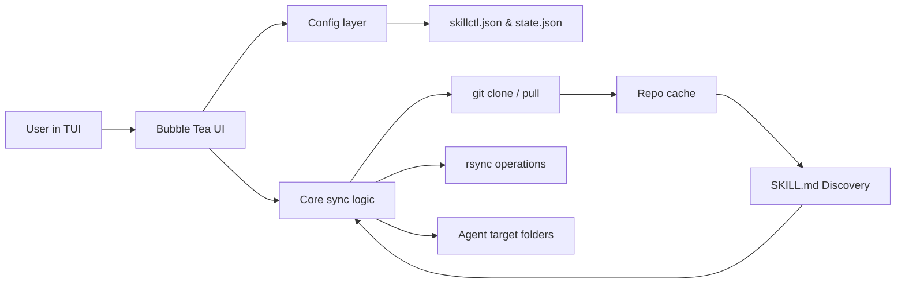

# skillctl

[](https://opensource.org/licenses/MIT)
[](https://go.dev/)
[](https://github.com/akl773/skillctl/actions/workflows/ci.yml)

> skillctl is a terminal application that helps AI agent users aggregate, select, and sync skills from multiple sources into local agent directories using a keyboard-driven TUI.

[Report an Issue](https://github.com/akl773/skillctl/issues)

## Overview

`skillctl` centralizes skill management across tools like Claude, Gemini, Cursor, Codex, OpenCode, and Kiro. It discovers skills from configured repositories, lets you select what you need, and syncs those selections to one or more target folders.

The interface is a keyboard-driven Bubble Tea TUI designed for fast local operations, minimizing the friction of manual skill management.

## Why It Exists

Managing skills manually across multiple agents and repositories is repetitive, error-prone, and hard to keep consistent. `skillctl` provides one place to manage source repositories, selected skills, and target locations while handling clone/pull and sync operations for you.

## Core Capabilities

- **Multi-repository catalog discovery**: Recursive `SKILL.md` scanning across all sources.
- **Collision-safe IDs**: Namespaced skill IDs (`<repo-id>/<skill-name>`) prevent overlaps.
- **Multi-target sync**: Synchronize selected skills to all agent directories in a single command.
- **Repository management**: Add, remove, and update source repositories (`/repos`, `/add`, `/pull`).
- **Target management**: Easily configure agent-specific destination folders (`/targets`).
- **Local import flow**: Import unmanaged skills into your managed source system.
- **Background updates**: Repositories are updated on app launch to keep your catalog fresh.

## Tech Stack

- **Language**: [Go](https://go.dev/) 1.25.8
- **TUI**: [Bubble Tea](https://github.com/charmbracelet/bubbletea), [Bubbles](https://github.com/charmbracelet/bubbles), [Lip Gloss](https://github.com/charmbracelet/lipgloss)
- **Testing**: Go `testing` + [Testify](https://github.com/stretchr/testify)
- **Tooling**: Make, [GoReleaser](https://goreleaser.com/), GitHub Actions
- **Dependencies**: `git`, `rsync`

## Architecture

`skillctl` uses a layered design separating UI orchestration, domain logic, and configuration management.



For deeper details, see [ARCHITECTURE.md](file:///Users/akhilsingh/Cursor/skillctl/docs/ARCHITECTURE.md).

## Project Structure

- `cmd/skillctl/` — CLI entrypoint and main application logic.
- `internal/config/` — Path handling, configuration persistence, and skill discovery.
- `internal/core/` — Git operations, selection logic, sync, and cleanup.
- `internal/ui/` — Bubble Tea models, views, and slash command handlers.
- `docs/` — Manuals and architectural documentation.
- `scripts/` — Automation scripts for releases and packaging.

## Getting Started

### Prerequisites
- **Go 1.25+** (for source builds)
- **git**
- **rsync**

### Installation

1. **Clone the repository**:
   ```bash
   git clone https://github.com/akl773/skillctl.git
   cd skillctl
   ```

2. **Build and install**:
   ```bash
   make install
   ```

3. **Homebrew (Recommended)**:
   ```bash
   brew install akl773/skillctl/skillctl
   ```

### Quick Start
Set an optional workspace location and launch:
```bash
export SKILLCTL_WORKSPACE="$HOME/.skillctl"
skillctl
```

## Configuration

### Environment Variables

| Variable | Required | Description | Default |
|----------|----------|-------------|---------|
| `SKILLCTL_WORKSPACE` | No | Overrides default workspace directory | `~/.skillctl` |

### Default Agent Targets

| Agent | Default Path |
|-------|--------------|
| Claude | `~/.claude/skills` |
| Gemini | `~/.gemini/antigravity/skills` |
| Cursor | `~/.cursor/skills/antigravity-awesome-skills/skills` |
| OpenCode | `~/.config/opencode/skills` |
| Codex | `~/.codex/skills` |
| Kiro | `~/.kiro/skills` |

## Running the Project

For local development and testing:
```bash
make run
```

To view version or use a custom workspace via flag:
```bash
skillctl --version
skillctl --workspace /custom/path
```

## Usage

Interactive slash commands drive the application:

```bash
/repos                      # List all source repositories
/add [url]                  # Add a new GitHub skills repo
/search [query]             # Find skills by name or description
/skills [index,...]         # Toggle skill selection (e.g., /skills 1,4)
/sync                       # Apply selections to all agent targets
/status                     # View workspace health and summary
/help                       # Show available commands
```

## API / Interface Summary

### CLI Flags

| Flag | Description |
|------|-------------|
| `--workspace` | Sets the workspace directory |
| `--version` | Prints version and exits |

### Primary Slash Commands

| Command | Purpose |
|---------|---------|
| `/pull` | Sync all configured upstream repositories |
| `/repo remove <id>` | Remove a repository source |
| `/target add <path>`| Add a new sync target |
| `/target remove <id>`| Remove a sync target |
| `/import` | Import unmanaged skills into local workspace |
| `/quit` | Exit the application |

## Development Workflow

Standard Go development tasks are mapped to `Makefile` targets:

```bash
make build   # Build binary to ./skillctl
make test    # Run all unit tests
make cover   # View test coverage report
```

Continuous Integration runs `go vet`, `govulncheck`, and the test suite on every push.

## Deployment

Releases are automated via GitHub Actions and GoReleaser.

To release a new version:
1. Tag the release: `git tag v1.2.3`
2. Push tags: `git push origin v1.2.3`

This triggers the build pipeline, publishes binaries, and updates the Homebrew formula.

## Documentation Map

- [Architecture Overview](file:///Users/akhilsingh/Cursor/skillctl/docs/ARCHITECTURE.md)
- [CI Pipeline Definitions](file:///Users/akhilsingh/Cursor/skillctl/.github/workflows/ci.yml)
- [Release Workflow](file:///Users/akhilsingh/Cursor/skillctl/.github/workflows/release.yml)

## Roadmap

- [ ] Improve integration-testability for external command execution.
- [ ] Expand automated coverage for interactive command paths.

## Contributing

1. Fork and clone the repository.
2. Create a focused branch for your change.
3. Implement changes with accompanying tests.
4. Run `make test` and `go vet ./...` locally.
5. Open a pull request with a detailed description.

## License

[MIT](https://opensource.org/licenses/MIT) © 2026 Akhil Singh
